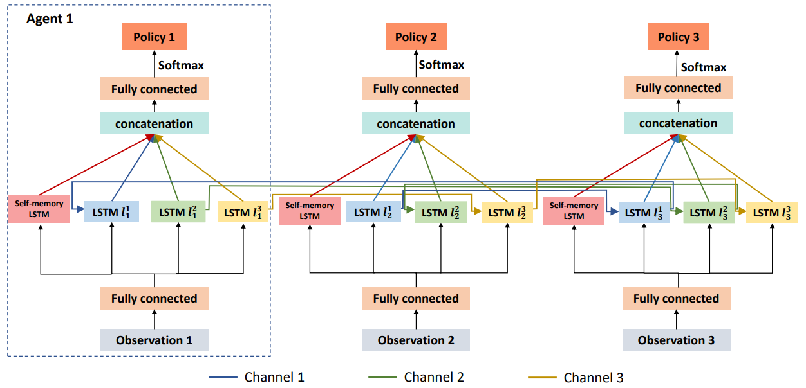

## FCMNet: Full Communication Memory Net for Team-Level Cooperation in Multi-Agent Systems

Decentralized cooperation in partially-observable multi-agent systems requires effective communications among agents. To support this effort, this work focuses on the class of problems where global communications are available but may be unreliable, thus precluding differentiable communication learning methods. We introduce FCMNet, a reinforcement learning based approach that allows agents to simultaneously learn a) an effective multi-hop communications protocol and b) a common, decentralized policy that enables team-level decision-making. Specifically, our proposed method utilizes the hidden states of multiple directional recurrent neural networks as communication messages among agents. Using a simple multi-hop topology, we endow each agent with the ability to receive information sequentially encoded by every other agent at each time step, leading to improved global cooperation. We demonstrate FCMNet on a challenging set of StarCraft II micromanagement tasks with shared rewards, as well as a collaborative multi-agent pathfinding task with individual rewards. There, our comparison results show that FCMNet outperforms state-of-the-art communication-based reinforcement learning methods in all StarCraft II micromanagement tasks, and value decomposition methods in certain tasks. We further investigate the robustness of FCMNet under realistic communication disturbances, such as random message loss or binarized messages (i.e., non-differentiable communication channels), to showcase FMCNet's potential applicability to robotic tasks under a variety of real-world conditions.

Read more: [Communication Learning for true Cooperation in Multi-Agent Systems](https://www.marmotlab.org/projects/comms_learning.html)